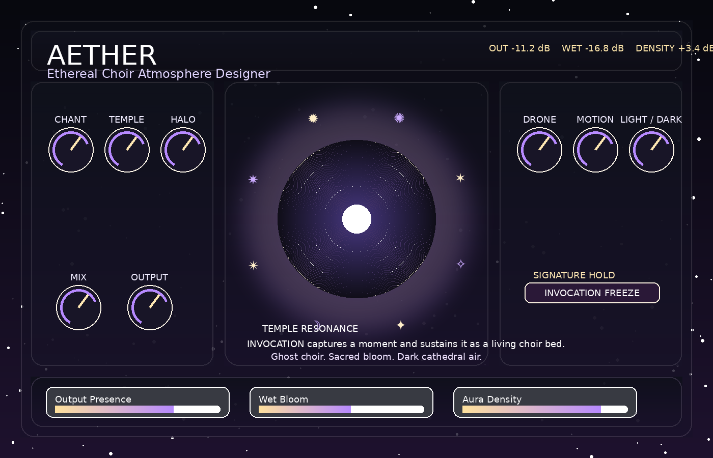

# AETHER

> **TizWildin Entertainment HUB — Experimental**
> **Role:** Choir and atmosphere designer
> **Status:** ⚠️ Beta
> **Formats:** VST3 · AU
> **License:** FREE (open source)

## Tagline
A choir and atmosphere designer for cinematic sound design — procedural choirs, pads, and evolving textures.

## Overview
AETHER is an atmosphere and choir designer built for cinematic, ambient, and game sound designers. It procedurally generates choral textures and evolving pads from a small set of high-level parameters.

Rather than playing back pre-recorded choirs, AETHER synthesises them, so every pad is unique to a project.

## Core features
- Procedural choir generation with syllable / formant control
- Evolving pad textures driven by slow modulators
- High-level macro controls for size, brightness, and tension
- Preset system with room for user-saved slots

## Typical workflows
- Film / trailer beds and ambient transitions
- Game-engine-friendly procedural atmospheres
- Ambient production and drone composition

## Compatibility
macOS (Intel + Apple Silicon), Windows 10+

## Source & downloads
- **Repo / source:** [https://github.com/GareBear99/AETHER_Choir-Atmosphere-Designer](https://github.com/GareBear99/AETHER_Choir-Atmosphere-Designer)
- **Latest release:** [https://github.com/GareBear99/AETHER_Choir-Atmosphere-Designer/releases/latest](https://github.com/GareBear99/AETHER_Choir-Atmosphere-Designer/releases/latest)
- **HUB dashboard:** [https://garebear99.github.io/TizWildinEntertainmentHUB/](https://garebear99.github.io/TizWildinEntertainmentHUB/)
- **HUB repo:** [https://github.com/GareBear99/TizWildinEntertainmentHUB](https://github.com/GareBear99/TizWildinEntertainmentHUB)

## Related projects
- [TizWildin HUB](https://github.com/GareBear99/TizWildinEntertainmentHUB)
- [WhisperGate](https://github.com/GareBear99/WhisperGate_Free-JUCE-Plugin)
- [WURP](https://github.com/GareBear99/WURP_Toxic-Motion-Engine_JUCE)

---

_This page is part of the Awesome Audio Plugins & Dev link-page set. It is the human-readable landing spot for **AETHER** inside the TizWildin Entertainment HUB ecosystem._
