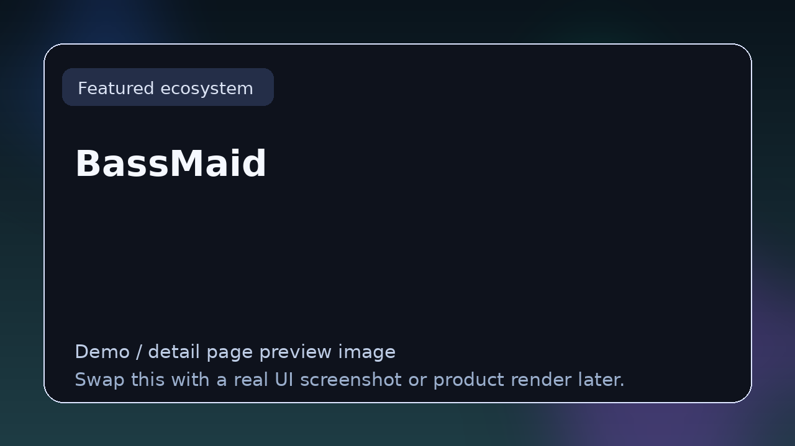

# BassMaid

> **TizWildin Entertainment HUB — Maid Suite**
> **Role:** Low-end processing toolkit
> **Status:** ✅ Production
> **Formats:** VST3 · AU
> **License:** FREE (open source)

## Tagline
A focused low-end processor that enhances bass weight, controls sub-bass energy, and tightens kick / 808 interaction without the usual multiband headaches.

## Overview
BassMaid is the low-end specialist in the Maid Suite. It combines harmonic enhancement, dynamic low-band control, and mono-management into a compact tool producers can drop on a bass bus to dial in the final sub without a chain of six plugins.

The intent is to keep decisions simple where they should be simple — sub level, weight, tightness — while still exposing the parameters that matter when mixing.

## Core features
- Sub-bass enhancement with tuned harmonic generation
- Low-band dynamic shaping for tight kick / 808 relationships
- Mono-summing below an adjustable cutoff
- Gain-matched bypass for honest A/B evaluation

## Typical workflows
- Tightening kick plus 808 interaction in trap and drill
- Adding speaker-audible weight to a sub-heavy mix
- Cleaning up mono compatibility for streaming masters

## Compatibility
macOS (Intel + Apple Silicon), Windows 10+

## Source & downloads
- **Repo / source:** [https://github.com/GareBear99/BassMaid](https://github.com/GareBear99/BassMaid)
- **Latest release:** [https://github.com/GareBear99/BassMaid/releases/latest](https://github.com/GareBear99/BassMaid/releases/latest)
- **HUB dashboard:** [https://garebear99.github.io/TizWildinEntertainmentHUB/](https://garebear99.github.io/TizWildinEntertainmentHUB/)
- **HUB repo:** [https://github.com/GareBear99/TizWildinEntertainmentHUB](https://github.com/GareBear99/TizWildinEntertainmentHUB)

## Related projects
- [TizWildin HUB](https://github.com/GareBear99/TizWildinEntertainmentHUB)
- [SpaceMaid](https://github.com/GareBear99/SpaceMaid)
- [GlueMaid](https://github.com/GareBear99/GlueMaid)
- [MixMaid](https://github.com/GareBear99/MixMaid)
- [ChainMaid](https://github.com/GareBear99/ChainMaid)

---

_This page is part of the Awesome Audio Plugins & Dev link-page set. It is the human-readable landing spot for **BassMaid** inside the TizWildin Entertainment HUB ecosystem._
