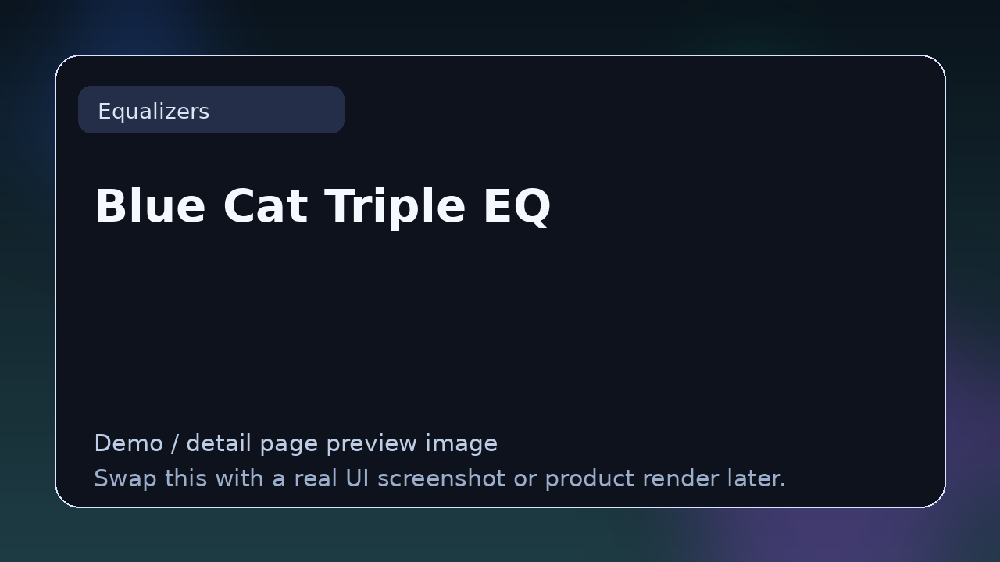

# Blue Cat Triple EQ

> **Category:** Equalizers  
> **Type:** Equalizer plugin

## Summary

Simple 3-band semi-parametric EQ.

## Why it belongs in this repository

This page gives readers a cleaner handoff from the main list to deeper evaluation. Instead of forcing a blind click, it explains what **Blue Cat Triple EQ** is, what kind of reader it suits, and where to go next.

## What to look for

- Useful for corrective mixing, tone shaping, resonance control, and mastering cleanup.
- Worth comparing by filter behavior, analyzer quality, CPU load, and special features like dynamic EQ or linear phase.
- Strong entries here solve either precision work or fast musical shaping.

## Best for

- Readers who want context before clicking away from the list
- Producers comparing options in **Equalizers**
- Developers researching the wider plugin and DSP ecosystem
- Anyone browsing the repo as a credible reference hub

## Official link

- **Website / repo:** [https://www.bluecataudio.com/Products/Product_TripleEQ/](https://www.bluecataudio.com/Products/Product_TripleEQ/)

