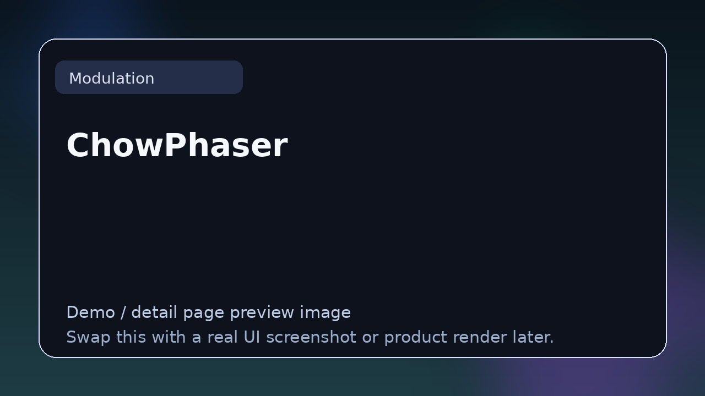

# ChowPhaser

> **Category:** Modulation  
> **Type:** Modulation plugin

## Summary

Open-source phaser with analog-modeled feedback.

## Why it belongs in this repository

This page gives readers a cleaner handoff from the main list to deeper evaluation. Instead of forcing a blind click, it explains what **ChowPhaser** is, what kind of reader it suits, and where to go next.

## What to look for

- Useful for movement, stereo width, chorus, phasing, and animation.
- Worth comparing by depth, sync behavior, stereo handling, and how naturally the motion sits in a mix.
- Strong entries here add movement without washing out the source.

## Best for

- Readers who want context before clicking away from the list
- Producers comparing options in **Modulation**
- Developers researching the wider plugin and DSP ecosystem
- Anyone browsing the repo as a credible reference hub

## Official link

- **Website / repo:** [https://github.com/jatinchowdhury18/ChowPhaser](https://github.com/jatinchowdhury18/ChowPhaser)

