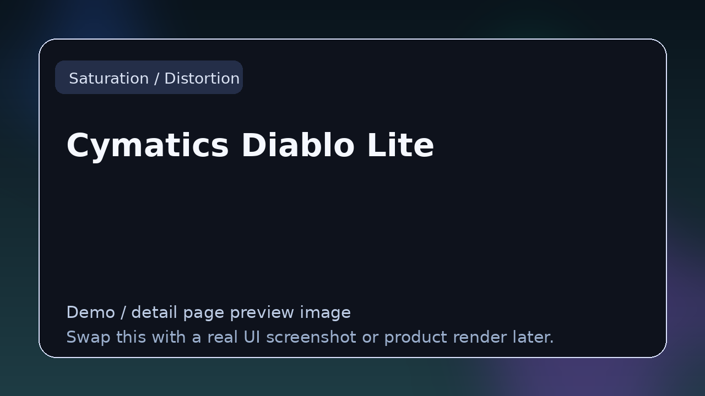

# Cymatics Diablo Lite

> **Category:** Saturation / Distortion  
> **Type:** Color / saturation plugin

## Summary

Free distortion and saturation plugin.

## Why it belongs in this repository

This page gives readers a cleaner handoff from the main list to deeper evaluation. Instead of forcing a blind click, it explains what **Cymatics Diablo Lite** is, what kind of reader it suits, and where to go next.

## What to look for

- Useful for harmonic enhancement, clipping control, aggressive sound design, and analog-style coloration.
- Worth comparing by tone curve, transient handling, oversampling, and how easily the effect sits in a mix.
- Strong entries here make nonlinearity controllable instead of messy.

## Best for

- Readers who want context before clicking away from the list
- Producers comparing options in **Saturation / Distortion**
- Developers researching the wider plugin and DSP ecosystem
- Anyone browsing the repo as a credible reference hub

## Official link

- **Website / repo:** [https://cymatics.fm/products/diablo-lite](https://cymatics.fm/products/diablo-lite)

