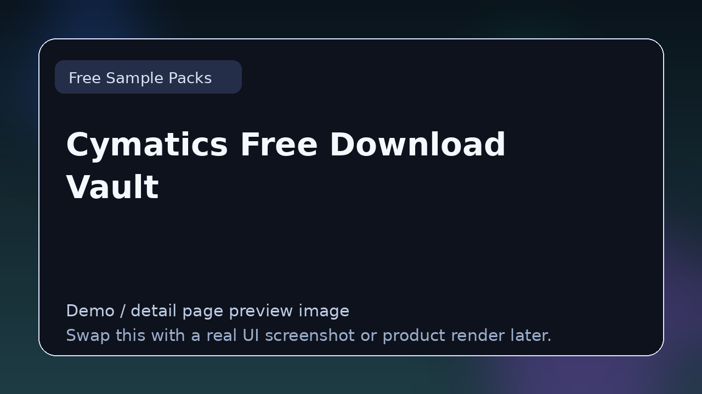

# Cymatics Free Download Vault

> **Category:** Free Sample Packs  
> **Type:** Sound resource

## Summary

Rotating collection of free packs and production resources.

## Why it belongs in this repository

This page gives readers a cleaner handoff from the main list to deeper evaluation. Instead of forcing a blind click, it explains what **Cymatics Free Download Vault** is, what kind of reader it suits, and where to go next.

## What to look for

- Useful for production starting points, layering, texture building, and sketching ideas quickly.
- Worth comparing by sound quality, originality, organization, and licensing clarity.
- Strong resources are easy to browse and immediately usable.

## Best for

- Readers who want context before clicking away from the list
- Producers comparing options in **Free Sample Packs**
- Developers researching the wider plugin and DSP ecosystem
- Anyone browsing the repo as a credible reference hub

## Official link

- **Website / repo:** [https://cymatics.fm/pages/free-download-vault](https://cymatics.fm/pages/free-download-vault)

