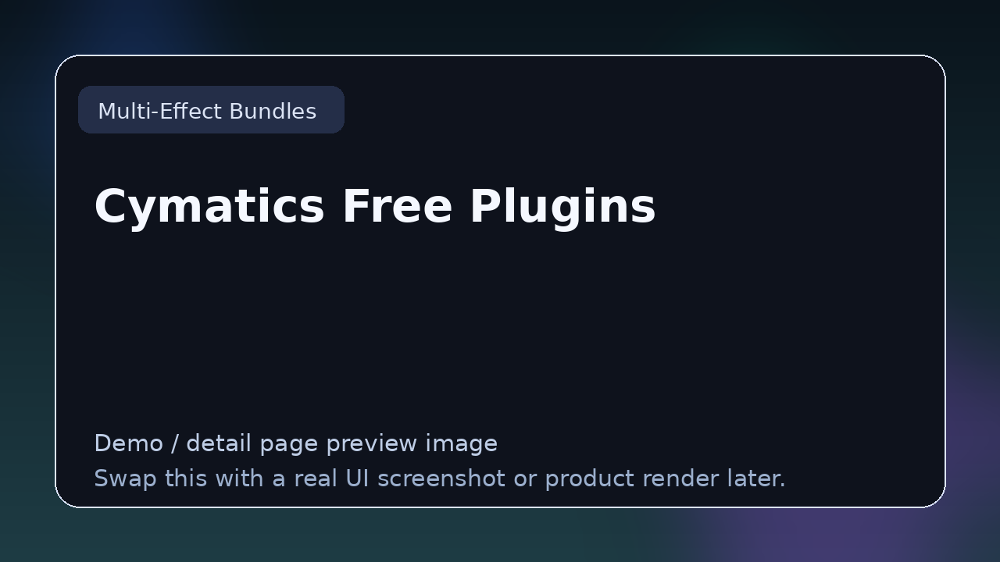

# Cymatics Free Plugins

> **Category:** Multi-Effect Bundles  
> **Type:** Plugin bundle

## Summary

Free plugin collection including Diablo Lite, Space Lite, Memory, and Deja Vu.

## Why it belongs in this repository

This page gives readers a cleaner handoff from the main list to deeper evaluation. Instead of forcing a blind click, it explains what **Cymatics Free Plugins** is, what kind of reader it suits, and where to go next.

## What to look for

- Useful when one download gives broad coverage across mixing, utility, modulation, or sound design.
- Worth comparing by bundle scope, install workflow, licensing clarity, and quality consistency.
- Strong bundles give newcomers a credible starting toolkit fast.

## Best for

- Readers who want context before clicking away from the list
- Producers comparing options in **Multi-Effect Bundles**
- Developers researching the wider plugin and DSP ecosystem
- Anyone browsing the repo as a credible reference hub

## Official link

- **Website / repo:** [https://cymatics.fm/pages/free-plugins](https://cymatics.fm/pages/free-plugins)

## Demo image note

The image above is a repository-local preview card so every entry shows a visible graphic on GitHub immediately. Replace it with a real screenshot, waveform view, UI render, or branded product image for a stronger demo page.

## Suggested future upgrades

- Add supported formats (VST3 / AU / CLAP / LV2 / standalone)
- Add platform support
- Add licensing notes
- Add open-source status
- Add standout features
- Add a short “why choose this over alternatives” section
