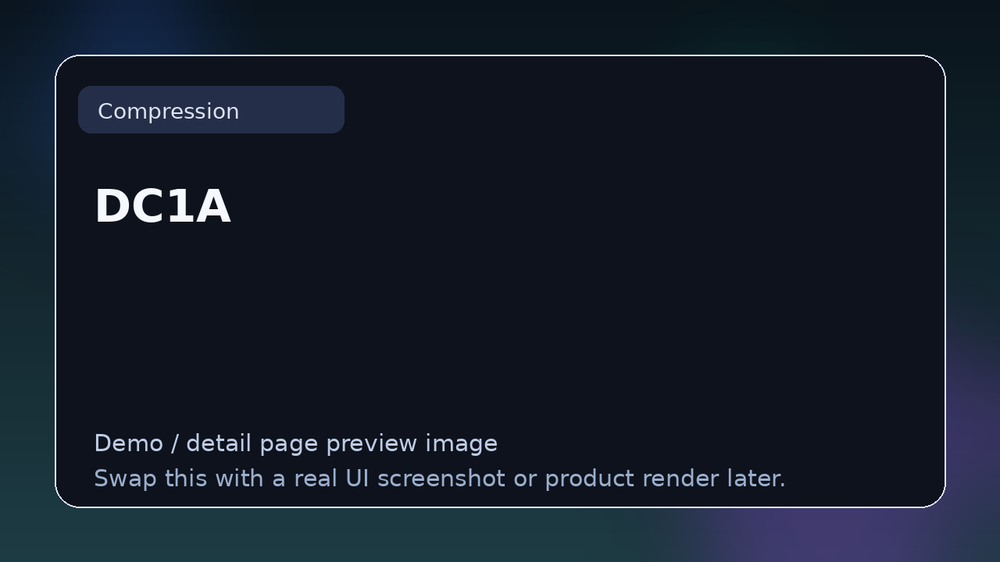

# DC1A

> **Category:** Compression  
> **Type:** Dynamics plugin

## Summary

Minimal one-knob compressor.

## Why it belongs in this repository

This page gives readers a cleaner handoff from the main list to deeper evaluation. Instead of forcing a blind click, it explains what **DC1A** is, what kind of reader it suits, and where to go next.

## What to look for

- Useful for leveling, glue, transient control, and sidechain work.
- Worth comparing by detector behavior, coloration, control range, and mix translation.
- Strong entries here provide either transparent control or intentional character.

## Best for

- Readers who want context before clicking away from the list
- Producers comparing options in **Compression**
- Developers researching the wider plugin and DSP ecosystem
- Anyone browsing the repo as a credible reference hub

## Official link

- **Website / repo:** [https://klanghelm.com/contents/products/DC1A.php](https://klanghelm.com/contents/products/DC1A.php)

## Demo image note

The image above is a repository-local preview card so every entry shows a visible graphic on GitHub immediately. Replace it with a real screenshot, waveform view, UI render, or branded product image for a stronger demo page.

## Suggested future upgrades

- Add supported formats (VST3 / AU / CLAP / LV2 / standalone)
- Add platform support
- Add licensing notes
- Add open-source status
- Add standout features
- Add a short “why choose this over alternatives” section
