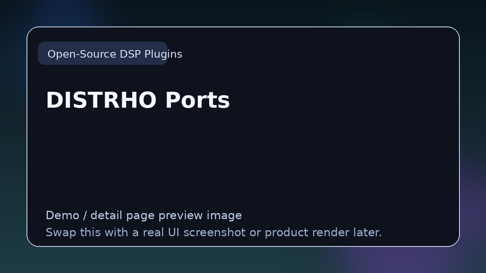

# DISTRHO Ports

> **Category:** Open-Source DSP Plugins  
> **Type:** Open-source DSP project

## Summary

Plugins ported to Linux and LV2 ecosystems.

## Why it belongs in this repository

This page gives readers a cleaner handoff from the main list to deeper evaluation. Instead of forcing a blind click, it explains what **DISTRHO Ports** is, what kind of reader it suits, and where to go next.

## What to look for

- Useful for learning implementation details, studying architecture, and understanding real plugin tradeoffs.
- Worth comparing by code quality, documentation, maintenance, and ease of inspection.
- Strong entries here teach by example rather than marketing.

## Best for

- Readers who want context before clicking away from the list
- Producers comparing options in **Open-Source DSP Plugins**
- Developers researching the wider plugin and DSP ecosystem
- Anyone browsing the repo as a credible reference hub

## Official link

- **Website / repo:** [https://github.com/DISTRHO/DISTRHO-Ports](https://github.com/DISTRHO/DISTRHO-Ports)

