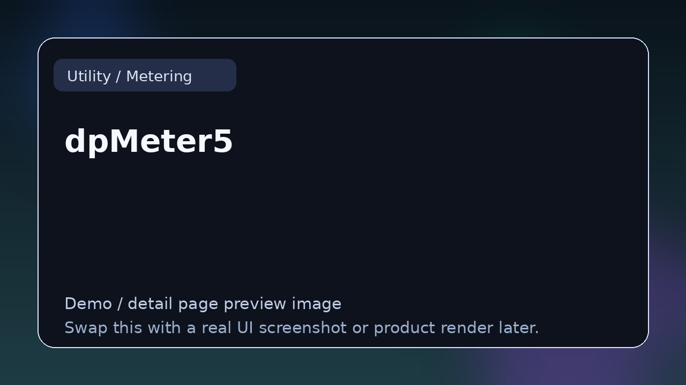

# dpMeter5

> **Category:** Utility / Metering  
> **Type:** Metering / utility tool

## Summary

Multichannel meter with RMS, LUFS, and true peak.

## Why it belongs in this repository

This page gives readers a cleaner handoff from the main list to deeper evaluation. Instead of forcing a blind click, it explains what **dpMeter5** is, what kind of reader it suits, and where to go next.

## What to look for

- Useful for analysis, loudness control, gain staging, phase checks, and translation.
- Worth comparing by accuracy, readability, latency, and whether it speeds up decisions.
- Strong entries here remove guesswork from production and development work.

## Best for

- Readers who want context before clicking away from the list
- Producers comparing options in **Utility / Metering**
- Developers researching the wider plugin and DSP ecosystem
- Anyone browsing the repo as a credible reference hub

## Official link

- **Website / repo:** [https://www.tb-software.com/TBProAudio/dpmeter5.html](https://www.tb-software.com/TBProAudio/dpmeter5.html)

