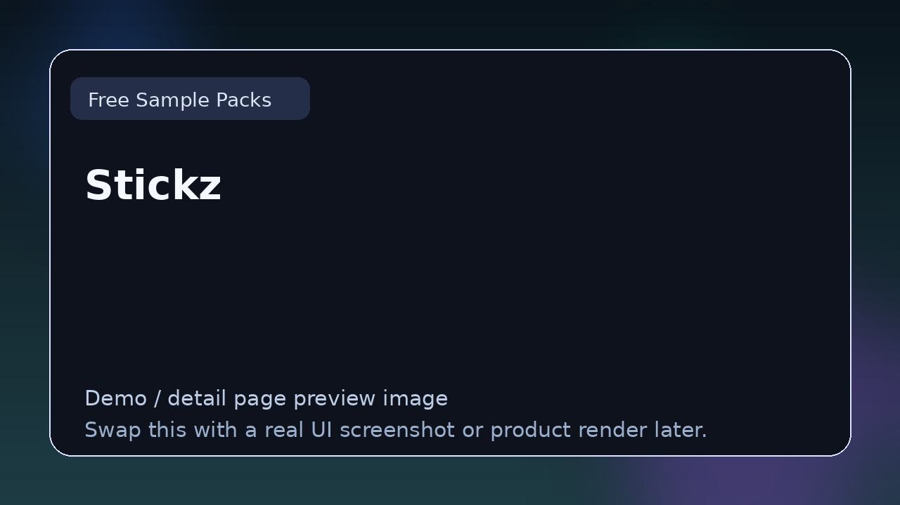

# Free Dark Piano Sound Kit

> **Category:** Free Sample Packs  
> **Type:** Sound resource

## Summary

Free dark piano sample pack with cinematic, moody, and atmospheric piano loops and one-shots for hip-hop, trap, R&B, and film scoring workflows.

## Why it belongs in this repository

Part of the TizWildin sample pack ecosystem. Provides genre-focused piano content designed for immediate use in dark or cinematic production contexts.

## What to look for

- Useful for dark melodies, cinematic scoring, and moody beat production.
- Worth comparing by tonal range, key labeling, BPM tagging, and mix-readiness.
- Strong packs here are organized, documented, and immediately usable.

## Best for

- Producers looking for dark or cinematic piano content
- Beat makers working in trap, drill, R&B, or film scoring
- Anyone browsing the repo for genre-focused sound resources

## Official link

- **Website / repo:** [https://github.com/GareBear99/Free-Dark-Piano-Sound-Kit](https://github.com/GareBear99/Free-Dark-Piano-Sound-Kit)
