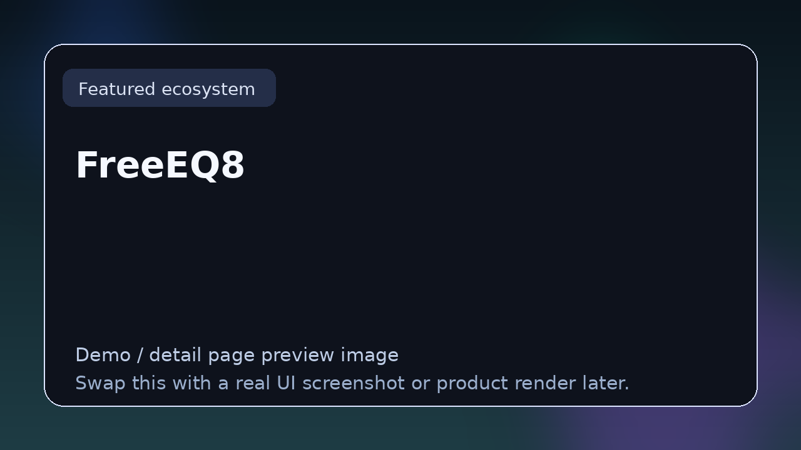

# FreeEQ8

> **TizWildin Entertainment HUB — Flagship**
> **Role:** Free open-source 8-band parametric EQ
> **Status:** ✅ Production
> **Formats:** VST3 · AU · Standalone
> **License:** FREE (open source)

## Tagline
A professional-grade, fully open-source 8-band parametric EQ built with JUCE — linear phase, dynamic EQ, match EQ, per-band drive, M/S processing, oversampling, and a 4096-point real-time spectrum analyzer.

## Overview
FreeEQ8 is engineered as the reference equalizer inside the TizWildin ecosystem. It is not a stripped-down demo; it is a mixing- and mastering-grade EQ that ships free under GPL-3.0 and competes directly with commercial dynamic/linear-phase EQs.

The plugin is designed around a "selected-band" paradigm — eight colored band buttons rebind a single set of high-precision controls — giving producers an interface that is fast to operate in a mix session while exposing the full depth of modern EQ features.

## Core features
- Eight independent parametric bands with full frequency / Q / gain control
- Six filter types per band: Bell, Low/High Shelf, High/Low Pass, Bandpass
- 12 / 24 / 48 dB per octave slopes via cascaded biquad stages
- Linear-phase mode (overlap-add FFT convolution, 2048-sample latency)
- Dynamic EQ per band with threshold, ratio, attack, release, and sidechain bandpass
- Per-band saturation (gain-compensated tanh waveshaper, 0-100 %)
- Mid/Side processing with per-band channel routing
- Oversampling at 1× / 2× / 4× / 8× using JUCE polyphase IIR half-bands
- Band linking groups (A/B) with frequency-ratio and delta-gain/Q propagation
- Match EQ — capture reference spectrum, compute per-bin correction
- Adaptive Q that widens with gain for musical boosts
- Real-time 4096-point FFT spectrum analyzer with pre/post toggle
- 30 factory presets, undo/redo via JUCE UndoManager and APVTS

## Architecture & internals
- Transposed Direct Form II biquad with 64-bit internal arithmetic
- RBJ Audio EQ Cookbook coefficients
- Coefficient refresh every 16 samples, 20 ms parameter smoothing
- Zero latency in minimum-phase mode; 2048-sample FIR in linear-phase mode
- Built with JUCE 7.0.12 against VST3 and AU SDKs

## Typical workflows
- Corrective mixing - pinpoint resonances with narrow Q and automate
- Mastering - linear-phase mode plus adaptive Q for transparent shaping
- Dynamic taming - frequency-specific compression via per-band dynamics
- Sound design - stack bells at the same frequency with different Q for resonant sweeps

## Compatibility
macOS 10.13+ (Intel + Apple Silicon), Windows 10+ (64-bit), Debian/Ubuntu 20.04+

## Source & downloads
- **Repo / source:** [https://github.com/GareBear99/FreeEQ8](https://github.com/GareBear99/FreeEQ8)
- **Latest release:** [https://github.com/GareBear99/FreeEQ8/releases/latest](https://github.com/GareBear99/FreeEQ8/releases/latest)
- **HUB dashboard:** [https://garebear99.github.io/TizWildinEntertainmentHUB/](https://garebear99.github.io/TizWildinEntertainmentHUB/)
- **HUB repo:** [https://github.com/GareBear99/TizWildinEntertainmentHUB](https://github.com/GareBear99/TizWildinEntertainmentHUB)

## Related projects
- [TizWildin HUB](https://github.com/GareBear99/TizWildinEntertainmentHUB)
- [Live dashboard](https://garebear99.github.io/TizWildinEntertainmentHUB/)
- [Therum (wavetable synth)](https://github.com/GareBear99/Therum_JUCE-Plugin)

---

_This page is part of the Awesome Audio Plugins & Dev link-page set. It is the human-readable landing spot for **FreeEQ8** inside the TizWildin Entertainment HUB ecosystem._
