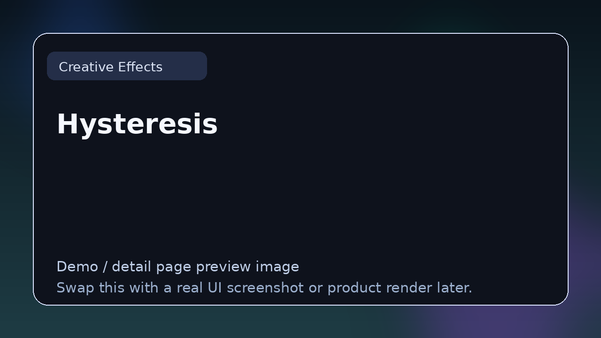

# Hysteresis

> **Category:** Creative Effects  
> **Type:** Creative effect plugin

## Summary

Glitch delay with modulation.

## Why it belongs in this repository

This page gives readers a cleaner handoff from the main list to deeper evaluation. Instead of forcing a blind click, it explains what **Hysteresis** is, what kind of reader it suits, and where to go next.

## What to look for

- Useful for glitch, texture, lo-fi treatment, and experimental transformation.
- Worth comparing by uniqueness, control over chaos, and whether the effect stays musically useful.
- Strong entries here have a clear identity without becoming one-trick clutter.

## Best for

- Readers who want context before clicking away from the list
- Producers comparing options in **Creative Effects**
- Developers researching the wider plugin and DSP ecosystem
- Anyone browsing the repo as a credible reference hub

## Official link

- **Website / repo:** [https://glitchmachines.com/products/hysteresis/](https://glitchmachines.com/products/hysteresis/)

