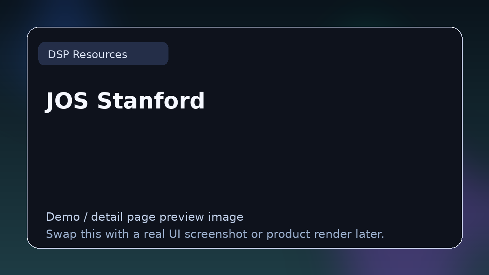

# JOS Stanford

> **Category:** DSP Resources  
> **Type:** DSP learning resource

## Summary

Julius O. Smith's music DSP resources.

## Why it belongs in this repository

This page gives readers a cleaner handoff from the main list to deeper evaluation. Instead of forcing a blind click, it explains what **JOS Stanford** is, what kind of reader it suits, and where to go next.

## What to look for

- Useful for understanding filters, transforms, dynamics, synthesis, and implementation patterns.
- Worth comparing by depth, readability, mathematical rigor, and practical usefulness.
- Strong resources stay relevant after the first read.

## Best for

- Readers who want context before clicking away from the list
- Producers comparing options in **DSP Resources**
- Developers researching the wider plugin and DSP ecosystem
- Anyone browsing the repo as a credible reference hub

## Official link

- **Website / repo:** [https://ccrma.stanford.edu/~jos/](https://ccrma.stanford.edu/~jos/)

