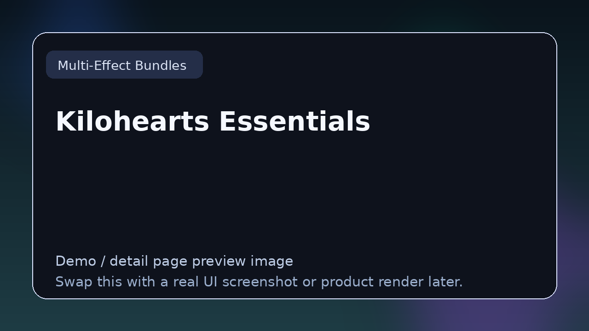

# Kilohearts Essentials

> **Category:** Multi-Effect Bundles  
> **Type:** Plugin bundle

## Summary

Free bundle of snap-in effects and utilities.

## Why it belongs in this repository

This page gives readers a cleaner handoff from the main list to deeper evaluation. Instead of forcing a blind click, it explains what **Kilohearts Essentials** is, what kind of reader it suits, and where to go next.

## What to look for

- Useful when one download gives broad coverage across mixing, utility, modulation, or sound design.
- Worth comparing by bundle scope, install workflow, licensing clarity, and quality consistency.
- Strong bundles give newcomers a credible starting toolkit fast.

## Best for

- Readers who want context before clicking away from the list
- Producers comparing options in **Multi-Effect Bundles**
- Developers researching the wider plugin and DSP ecosystem
- Anyone browsing the repo as a credible reference hub

## Official link

- **Website / repo:** [https://kilohearts.com/products/kilohearts_essentials](https://kilohearts.com/products/kilohearts_essentials)

