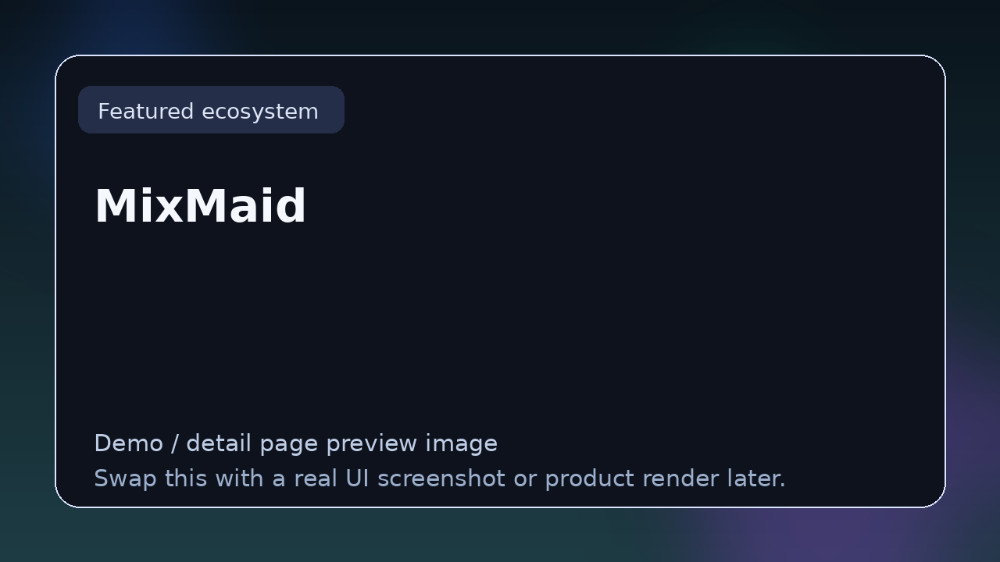

# MixMaid

> **TizWildin Entertainment HUB — Maid Suite**
> **Role:** Spectral balance and mix correction
> **Status:** ✅ Production
> **Formats:** VST3 · AU
> **License:** FREE (open source)

## Tagline
Real-time spectral balance and mix-correction assistant — gently guides a mix toward a balanced tonal distribution, proper headroom, and controlled dynamics.

## Overview
MixMaid is a correction-oriented assistant that continuously evaluates a mix for spectral balance, dynamic consistency, and headroom.

It applies gentle corrective moves rather than aggressive processing, making it suitable for a late-stage mixing insert or a pre-mastering reference tool.

## Core features
- Real-time spectral analysis against a reference curve
- Gentle multiband correction guided by the analysis
- Dynamic-range monitoring with loudness and crest metering
- Headroom and ceiling warnings

## Typical workflows
- Late-stage mix balancing before mastering
- Teaching context: showing students where the mix leans
- Reality check after long mixing sessions when ears are tired

## Compatibility
macOS (Intel + Apple Silicon), Windows 10+

## Source & downloads
- **Repo / source:** [https://github.com/GareBear99/MixMaid](https://github.com/GareBear99/MixMaid)
- **Latest release:** [https://github.com/GareBear99/MixMaid/releases/latest](https://github.com/GareBear99/MixMaid/releases/latest)
- **HUB dashboard:** [https://garebear99.github.io/TizWildinEntertainmentHUB/](https://garebear99.github.io/TizWildinEntertainmentHUB/)
- **HUB repo:** [https://github.com/GareBear99/TizWildinEntertainmentHUB](https://github.com/GareBear99/TizWildinEntertainmentHUB)

## Related projects
- [TizWildin HUB](https://github.com/GareBear99/TizWildinEntertainmentHUB)
- [GlueMaid](https://github.com/GareBear99/GlueMaid)
- [FreeEQ8](https://github.com/GareBear99/FreeEQ8)

---

_This page is part of the Awesome Audio Plugins & Dev link-page set. It is the human-readable landing spot for **MixMaid** inside the TizWildin Entertainment HUB ecosystem._
