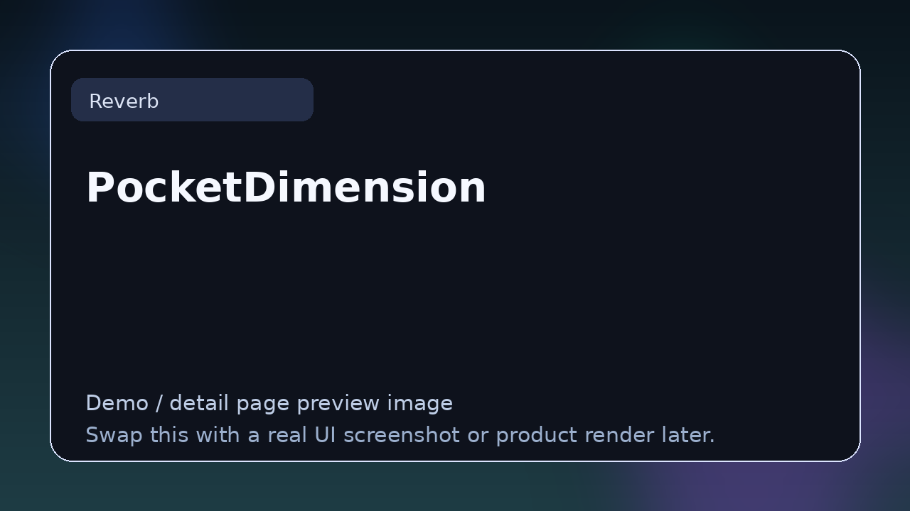

# PocketDimension

> **Category:** Reverb  
> **Type:** Reverb / space plugin

## Summary

Stereo enhancer and reverb-style utility.

## Why it belongs in this repository

This page gives readers a cleaner handoff from the main list to deeper evaluation. Instead of forcing a blind click, it explains what **PocketDimension** is, what kind of reader it suits, and where to go next.

## What to look for

- Useful for depth, ambience, room simulation, cinematic tails, and sound-design space creation.
- Worth comparing by algorithm style, stereo field, modulation, decay control, and CPU use.
- Strong entries here create space without burying the source.

## Best for

- Readers who want context before clicking away from the list
- Producers comparing options in **Reverb**
- Developers researching the wider plugin and DSP ecosystem
- Anyone browsing the repo as a credible reference hub

## Official link

- **Website / repo:** [https://www.audiodamage.com/pages/free-and-legacy](https://www.audiodamage.com/pages/free-and-legacy)

