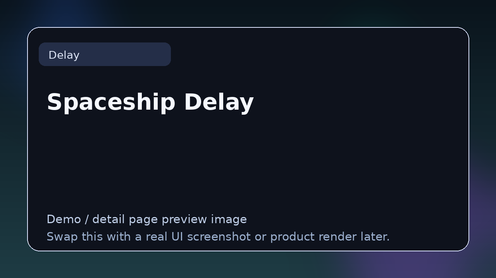

# Spaceship Delay

> **Category:** Delay  
> **Type:** Delay plugin

## Summary

Delay with filters and modulation.

## Why it belongs in this repository

This page gives readers a cleaner handoff from the main list to deeper evaluation. Instead of forcing a blind click, it explains what **Spaceship Delay** is, what kind of reader it suits, and where to go next.

## What to look for

- Useful for groove, width, texture, and modulation-driven movement.
- Worth comparing by timing workflow, feedback topology, tone shaping, and creative modulation options.
- Strong entries here handle both utility echo and character effects well.

## Best for

- Readers who want context before clicking away from the list
- Producers comparing options in **Delay**
- Developers researching the wider plugin and DSP ecosystem
- Anyone browsing the repo as a credible reference hub

## Official link

- **Website / repo:** [https://www.kvraudio.com/product/spaceship-delay-by-musical-entropy](https://www.kvraudio.com/product/spaceship-delay-by-musical-entropy)

