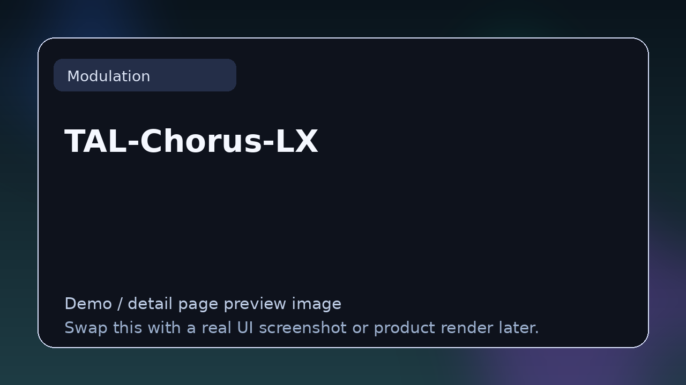

# TAL-Chorus-LX

> **Category:** Modulation  
> **Type:** Modulation plugin

## Summary

Juno-style chorus emulation.

## Why it belongs in this repository

This page gives readers a cleaner handoff from the main list to deeper evaluation. Instead of forcing a blind click, it explains what **TAL-Chorus-LX** is, what kind of reader it suits, and where to go next.

## What to look for

- Useful for movement, stereo width, chorus, phasing, and animation.
- Worth comparing by depth, sync behavior, stereo handling, and how naturally the motion sits in a mix.
- Strong entries here add movement without washing out the source.

## Best for

- Readers who want context before clicking away from the list
- Producers comparing options in **Modulation**
- Developers researching the wider plugin and DSP ecosystem
- Anyone browsing the repo as a credible reference hub

## Official link

- **Website / repo:** [https://tal-software.com/products/tal-chorus-lx](https://tal-software.com/products/tal-chorus-lx)

## Demo image note

The image above is a repository-local preview card so every entry shows a visible graphic on GitHub immediately. Replace it with a real screenshot, waveform view, UI render, or branded product image for a stronger demo page.

## Suggested future upgrades

- Add supported formats (VST3 / AU / CLAP / LV2 / standalone)
- Add platform support
- Add licensing notes
- Add open-source status
- Add standout features
- Add a short “why choose this over alternatives” section
