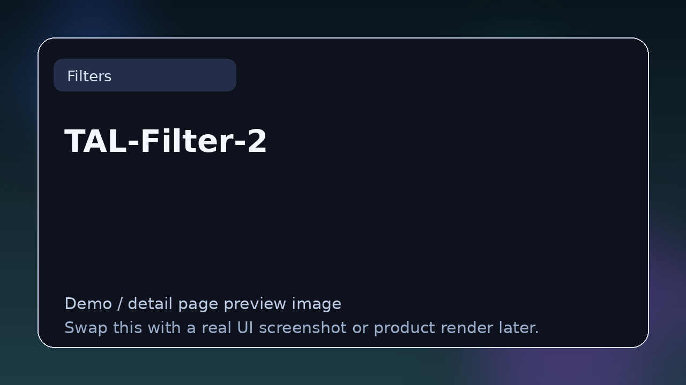

# TAL-Filter-2

> **Category:** Filters  
> **Type:** Filter plugin

## Summary

Host-synced filter with tempo-synced modulation.

## Why it belongs in this repository

This page gives readers a cleaner handoff from the main list to deeper evaluation. Instead of forcing a blind click, it explains what **TAL-Filter-2** is, what kind of reader it suits, and where to go next.

## What to look for

- Useful for sweeps, rhythmic shaping, spectral movement, and performance automation.
- Worth comparing by filter character, resonance behavior, modulation depth, and visualization.
- Strong entries here make frequency movement expressive and predictable.

## Best for

- Readers who want context before clicking away from the list
- Producers comparing options in **Filters**
- Developers researching the wider plugin and DSP ecosystem
- Anyone browsing the repo as a credible reference hub

## Official link

- **Website / repo:** [https://tal-software.com/products/tal-filter-2](https://tal-software.com/products/tal-filter-2)

