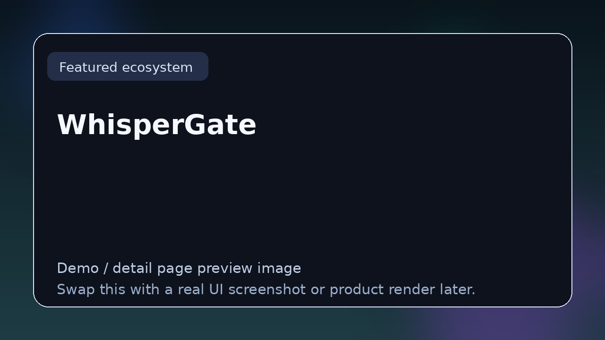

# WhisperGate

> **TizWildin Entertainment HUB — Experimental**
> **Role:** Procedural whispers and ritual atmospheres
> **Status:** ✅ Production
> **Formats:** VST3 · AU
> **License:** FREE (open source)

## Tagline
Procedural whispers, ghost choirs, and ritual atmospheres controlled through an interactive geometry interface.

## Overview
WhisperGate generates whispered voices, ghost-choir beds, and ritual-sounding atmospheres. The defining feature is its control surface: a geometric diagram where points, edges, and regions map to voice density, pitch range, phrasing, and emotion.

The plugin is aimed at game sound designers, horror-adjacent producers, and film composers who need believable but unsettling vocal atmospheres without recording them by hand.

## Core features
- Procedural whisper / choir generation
- Interactive geometry UI for shaping voice behaviour
- Density, pitch-range, phrasing, and mood macros
- Stereo imaging tuned for headphones and cinematic mixes

## Typical workflows
- Horror and psychological thriller sound design
- Ritual-style ambient and dark cinematic
- Game-engine streamable beds for dynamic scenes

## Compatibility
macOS (Intel + Apple Silicon), Windows 10+

## Source & downloads
- **Repo / source:** [https://github.com/GareBear99/WhisperGate_Free-JUCE-Plugin](https://github.com/GareBear99/WhisperGate_Free-JUCE-Plugin)
- **Latest release:** [https://github.com/GareBear99/WhisperGate_Free-JUCE-Plugin/releases/latest](https://github.com/GareBear99/WhisperGate_Free-JUCE-Plugin/releases/latest)
- **HUB dashboard:** [https://garebear99.github.io/TizWildinEntertainmentHUB/](https://garebear99.github.io/TizWildinEntertainmentHUB/)
- **HUB repo:** [https://github.com/GareBear99/TizWildinEntertainmentHUB](https://github.com/GareBear99/TizWildinEntertainmentHUB)

## Related projects
- [TizWildin HUB](https://github.com/GareBear99/TizWildinEntertainmentHUB)
- [AETHER](https://github.com/GareBear99/AETHER_Choir-Atmosphere-Designer)
- [PAP Forge](https://github.com/GareBear99/PAP-Forge-Audio)

---

_This page is part of the Awesome Audio Plugins & Dev link-page set. It is the human-readable landing spot for **WhisperGate** inside the TizWildin Entertainment HUB ecosystem._
